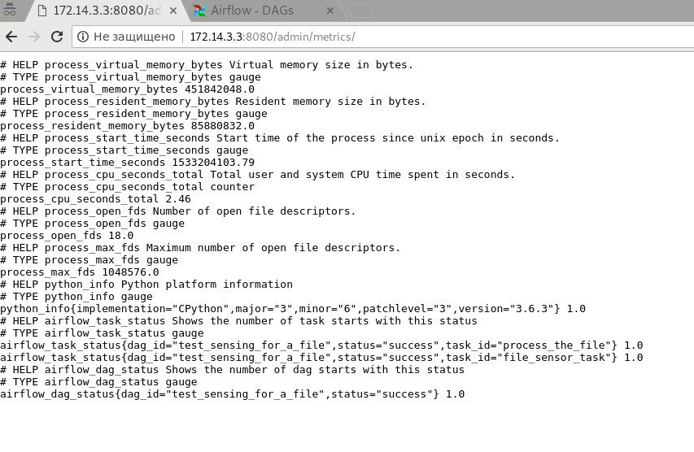
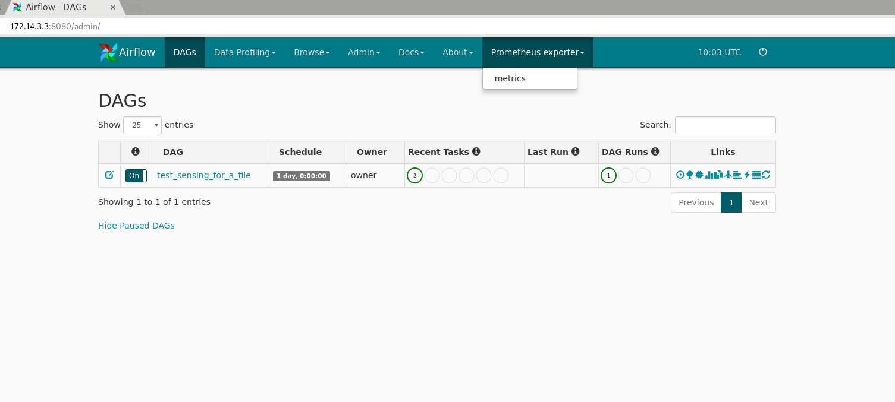

# Airflow prometheus exporter

Exposes dag and task based metrics from Airflow to a Prometheus compatible endpoint.

## Screenshots



## Install

Install project requirements:
```
pip3 install prometheus_client
```
Switch to the root of your Airflow project.
```
git clone https://github.com/epoch8/airflow-exporter plugins/prometheus_exporter
```
That's it. You're done.

# Metrics
Metrics will be available at 
```
http://<your_airflow_host_and_port>/admin/metrics
```

## `airflow_task_status`
Labels:
* `dag_id`
* `task_id`
* `status`

Value: number of tasks in specific status.

## `airflow_dag_status`
Labels:
* `dag_id`
* `status`

Value: number of dags in specific status.

# License

Distributed under the BSD license. See [LICENSE](LICENSE) for more
information.
